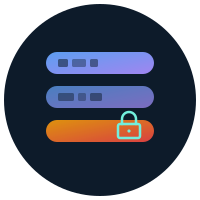

  

<h1 align="center">NAS-tools</h1>

  <strong>Your own storage, on machines you do not fully trust.</strong>

  
  
  
  

> The storage peer holds ciphertext and cannot read your data. It stores blobs addressed by their content, and hands them back when asked.

---

A NAS in a cupboard, a rented VPS, a friend's spare box: the default is that none of them need to know what they are storing. Encryption is not free — a peer that cannot read your photos also cannot make thumbnails of them — so the mode is chosen per namespace, honestly.

| mode | who can read it | what you get | what you lose |
|---|---|---|---|
| `transit-only` | the peer | server-side browsing, thumbnails, search | the peer can read everything |
| `passphrase` | anyone with the passphrase | recovery from memory alone | offline brute force is possible |
| `e2ee` | only your key | nothing else can read it | lose the key, lose the data |

Picking the strongest mode everywhere is usually the wrong answer.

## Crates

| crate | what it is |
|---|---|
| `nas-cli` | the `nas` binary |
| `nas-core` | shared types |
| `nas-crypto` | key schedule and domain separation |
| `nas-store` | chunking, padding, content-addressed blobs, manifests |
| `nas-vault` | identities, namespace secrets, passphrase wrap |
| `nas-slots` | signed, chained heads for mutable pointers |
| `nas-lease` | signed leases, so a peer can collect garbage it cannot read |
| `nas-peer` | the storage peer |
| `nas-transfer` | peer transport over a post-quantum channel |
| `nas-delete` | append-only deletion approval |
| `nas-gateway` | localhost S3-shaped gateway |

Adjacent: [`simple-tools`](https://github.com/zeta1999/simple-tools), [`simple-pqc`](https://github.com/zeta1999/simple-pqc).

## License

MIT OR Apache-2.0
